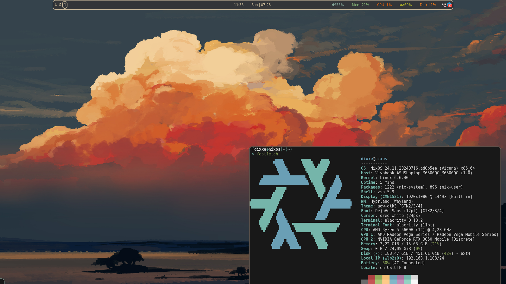

<h1 align=center>❄️ Welcome to dixxe's NixOS config! ❄️</h1>



---
> ### 📝
> NixOS is not like any other Linux distributive. Declarative, Reproducible, Immutable and Atomic - this OS is another whole world, world full of wonders. ✨

---
## Information about config
* My main goal is made **easy to understand, no boiler-plate config**, so anyone can fork it and modify for own needs!
* I'm still new to NixOS so this config will change very much as I learn new efficient approaches to do it

## How to use it:
```bash
git clone https://this/repo
cd your/path/to/config
sudo nixos-rebuild switch --flake .
home-manager switch --flake .
```

## How to modify it:
<details><summary>Cloned this repo:</summary>

    1. Delete `.git/` folder from your config, so you can add files and build without warnings.
    2. Use your favourite code editor

</details>


<details><summary>Forked this repo:</summary>

    1. You ready to do any changes
    2. Use your favourite code editor
    3. Use git commands to commit changes to your repo

</details>


## Special thanks
[hand7s](https://github.com/s0me1newithhand7s). - thanks to this guy, he told me about nixos in first place and teach me basics of it! Also he have much better config and understanding about what he doing :D

**To you** if you decided to give a try my config!

